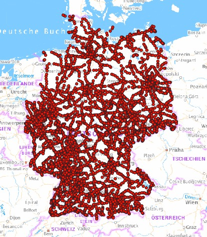
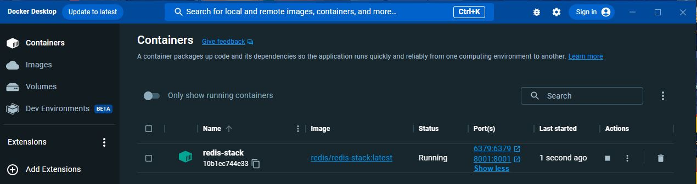
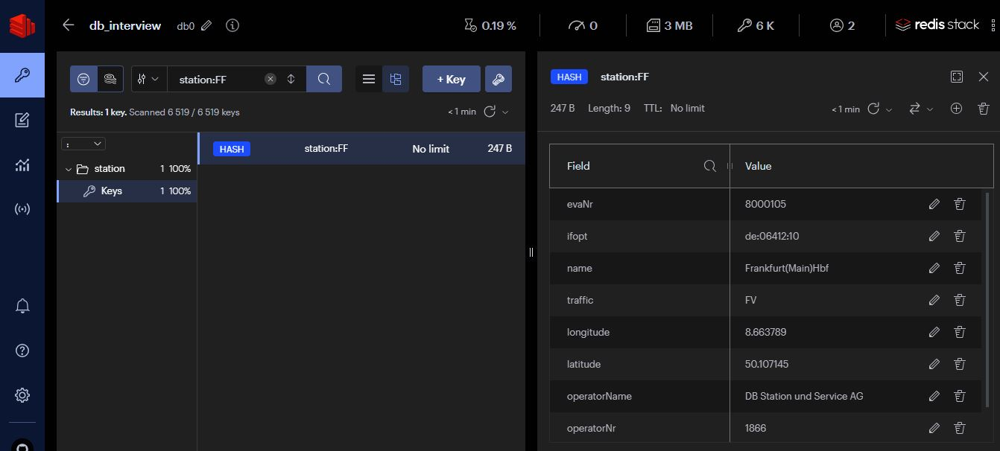
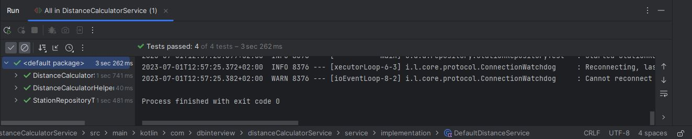
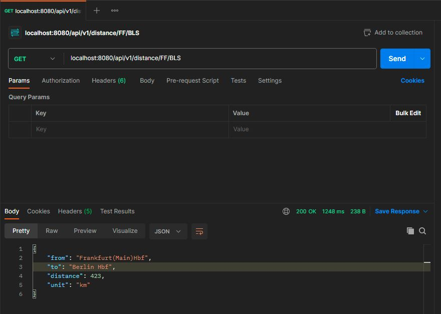

# DB Interview - CASE 2

### Distance calculator railroad stations

This project implements the backend of a distance calculator for railroad stations in germany.

Following technologies were used:

* Spring Boot with Kotlin
* Redis running in a Docker Container

### DATA

### Docker running Redis

### Redis database containing data

### Tests passed

### API Call with Postman

